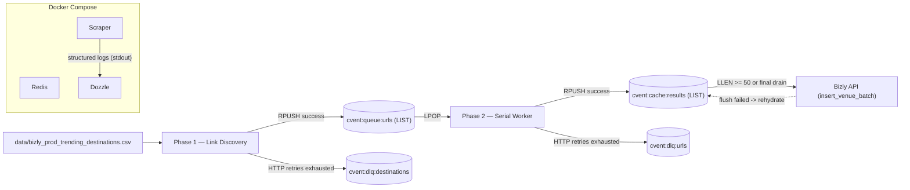
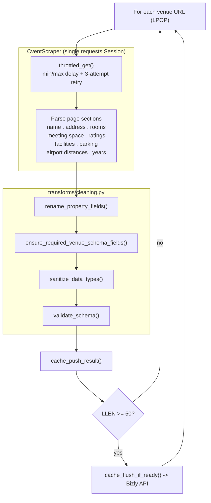

# Cvent Venue Scraper

A modular Python scraper that collects venue details from Cvent.com for a list of city/country destinations, backed by a Redis-queue pipeline with DLQs, a result cache that flushes to the Bizly API in batches of 50, and live log tailing via Dozzle.

## How It Works

**Phase 1 — Link Discovery**
Reads a CSV of `country,city_name` pairs and crawls Cvent's paginated venue listing pages. Each discovered URL is **RPUSH**ed onto a Redis work queue (`cvent:queue:urls`). If a destination fails after HTTP retries, it is pushed to the destinations DLQ and the run continues.

**Phase 2 — Venue Scraping**
Serially **LPOP**s URLs from the Redis queue, scrapes each venue page (name, address, room counts, meeting space, ratings, parking, airport distances, facilities, year built/renovated, tax rate, occupancy rate), and **RPUSH**es the validated result onto a Redis result cache (`cvent:cache:results`). When the cache reaches `BATCH_SIZE` (50), it atomically drains via a `MULTI/EXEC` pipeline (`LRANGE` + `DEL`) and POSTs to the Bizly API. A failed API flush is **rehydrated** back into the cache to prevent data loss. A final unconditional drain runs at the end of Phase 2.

Failed URL scrapes (after `throttled_get` exhausts its HTTP retries) go straight to the URL DLQ (`cvent:dlq:urls`) — no job-level requeue. Non-blocking: one destination or URL failing never stops the pipeline.

### Architecture



### Phase internals



### Redis key layout

| Key | Type | Role |
|---|---|---|
| `cvent:queue:urls` | LIST | Phase 1 RPUSH, Phase 2 LPOP (FIFO work queue) |
| `cvent:dlq:destinations` | LIST | Destination-level failures from Phase 1 |
| `cvent:dlq:urls` | LIST | URL-level scrape failures from Phase 2 |
| `cvent:cache:results` | LIST | Scraped venues awaiting batch flush to Bizly |

### Logging

Every log line carries `trace=<8-char-uuid>` and `dest=<city,country>` context (via `contextvars` and a logging filter), so you can follow a single destination or URL end-to-end through Dozzle's search. Key traceable events:

`PHASE1_START` -> `DEST_START` -> `DEST_SUCCESS urls=N` | `DEST_FAIL_DLQ error=...` -> `PHASE1_END enqueued=N dlq_destinations=N` -> `PHASE2_START queue_len=N` -> `URL_START link=...` -> `URL_SUCCESS` | `URL_FAIL_DLQ error=...` -> `BATCH_FLUSH_START/SUCCESS/FAIL size=50` -> `FINAL_DRAIN size=N` -> `PHASE2_END scraped=N dlq_urls=N` -> `RUN_SUMMARY ...`

---

## Prerequisites

- **Docker Desktop** (or any Docker Engine + `docker compose` v2) — recommended for all runs
- Alternatively for local-only runs: **Python 3.12.x** and a locally-reachable Redis

---

## Quick Start (Docker Compose — recommended)

This brings up three services on one network: `redis`, `scraper`, and `dozzle` (log viewer).

### 1. Create your `.env`

```bash
cp .env.example .env
```

Open `.env` and paste your `BIZLY_WEBHOOK_KEY`. You do **not** need to edit `REDIS_URL` — Docker Compose overrides it to `redis://redis:6379/0` inside the `scraper` container (see [docker-compose.yml](docker-compose.yml)).

### 2. Add the input CSV

Place your destinations file at:

```
data/bizly_prod_trending_destinations.csv
```

Required columns:

```csv
country,city_name
United States,New York
France,Paris
```

### 3. Run everything

```bash
docker compose up --build
```

This will:

- Start Redis (healthchecked, persisted to a named volume `redis_data`).
- Start Dozzle on [http://localhost:8080](http://localhost:8080) for live log tailing.
- Wait for Redis to be healthy, then run the scraper to completion.

Open Dozzle at [http://localhost:8080](http://localhost:8080) to watch `scraper` logs in real time. Filter by `URL_FAIL_DLQ`, a `trace=<id>`, or `dest=San Francisco,United States` to trace a single destination or URL through both phases.

The scraper container exits on completion. Redis and Dozzle keep running (`restart: unless-stopped`). Stop everything with:

```bash
docker compose down
```

### 4. After code changes

The scraper source is baked into the image at build time, so rebuild before re-running:

```bash
docker compose up --build scraper
```

### Inspecting Redis state

```bash
# queue + DLQ counts
docker compose exec redis redis-cli LLEN cvent:queue:urls
docker compose exec redis redis-cli LLEN cvent:dlq:urls
docker compose exec redis redis-cli LLEN cvent:dlq:destinations
docker compose exec redis redis-cli LLEN cvent:cache:results

# peek the first DLQ entry
docker compose exec redis redis-cli LINDEX cvent:dlq:urls 0
```

### Port map

| Service | Host port | Container port |
|---|---|---|
| `redis` | `6380` | `6379` |
| `dozzle` | `8080` | `8080` |

Note: Redis is exposed on host port **`6380`** to avoid clashing with a local Redis on `6379`. From inside the Docker network, containers still use `redis:6379`.

---

## Running Locally (without Docker)

Useful for quick iteration. Requires Python 3.12 and a Redis reachable from your host.

### 1. Create a venv and install

```bash
python3 -m venv venv
source venv/bin/activate       # Windows: venv\Scripts\activate
pip install -r requirements.txt
cp .env.example .env
```

### 2. Make sure Redis is reachable

Pick one:

- **Use the dockerized Redis** (recommended):
  ```bash
  docker compose up -d redis
  # Redis is now on host at localhost:6380 (see docker-compose.yml port map)
  ```
  Then set in `.env`:
  ```
  REDIS_URL=redis://localhost:6380/0
  ```

- **Or run a native Redis on the default port:**
  ```bash
  brew services start redis     # macOS
  # .env: REDIS_URL=redis://localhost:6379/0
  ```

### 3. Run

```bash
python main.py
```

If you see `ConnectionRefusedError: [Errno 61] ... localhost:6379`, Redis is not running on the port you pointed `REDIS_URL` at — follow step 2.

---

## Configuration

| Variable | Default | Description |
|---|---|---|
| `DEBUG_MODE` | `true` | If `true`, Phase 1 stops enqueueing after `DEBUG_LIMIT` URLs |
| `DEBUG_LIMIT` | `5` | Max URLs to enqueue in debug mode |
| `MAX_PAGES` | `5` | Max pagination pages to crawl per city |
| `MIN_DELAY` | `1.0` | Min seconds between HTTP requests |
| `MAX_DELAY` | `3.0` | Max seconds between HTTP requests |
| `REQUEST_TIMEOUT` | `20` | HTTP request timeout (seconds) |
| `MAX_RETRIES` | `3` | HTTP retry attempts inside `throttled_get` before DLQ |
| `BATCH_SIZE` | `50` | Cache size that triggers a Bizly API flush |
| `INPUT_CSV` | `data/bizly_prod_trending_destinations.csv` | Input file |
| `OUTPUT_DIR` | `output` | Local CSV output directory (when using `save_data_to_csv`) |
| `OUTPUT_FILENAME` | `cvent_venues.csv` | Local CSV filename |
| `BIZLY_API_URL` | `https://api-dev.bizly.com/hooks/venues/scraper/batch` | Batch insert endpoint |
| `BIZLY_WEBHOOK_KEY` | *(required)* | Auth header for Bizly API |
| `REDIS_URL` | `redis://localhost:6379/0` | Host runs. Docker Compose overrides this to `redis://redis:6379/0` in the `scraper` container |

---

## Project Structure

```
cvent-scraper/
├── main.py                              # Entry point — run_phase1() + run_phase2()
├── config.py                            # All tunable settings (env-backed)
├── services/
│   ├── http.py                          # throttled_get() + HEADERS (HTTP retries)
│   ├── scraper.py                       # CventScraper — single requests.Session, DOM extraction
│   ├── redis_client.py                  # Singleton redis.Redis from REDIS_URL
│   ├── queues.py                        # enqueue_url / pop_url / DLQ / cache helpers
│   └── logging_setup.py                 # contextvars-backed trace_id/dest injection
├── models/
│   └── venue.py                         # VenueDetailsSchema (Pydantic)
├── transforms/
│   └── cleaning.py                      # rename / ensure-required / sanitize / validate
├── storage/
│   ├── csv_writer.py                    # Local CSV utility (optional)
│   └── bizly_api/
│       └── insert_batch_venues.py       # Batch POST to Bizly API
├── data/                                # Input CSV (bind-mounted read-only in Docker)
├── output/                              # Local CSV output (bind-mounted in Docker)
├── Dockerfile                           # python:3.12-slim + PYTHONUNBUFFERED=1
├── docker-compose.yml                   # redis + scraper + dozzle
├── .dockerignore
├── .env.example
└── requirements.txt
```

---

## Operational notes

- **Retries**: `throttled_get` (3 attempts, exponential backoff) is the only retry layer. A scrape that still fails goes straight to the URL DLQ — no job-level requeue.
- **Concurrency**: Phase 2 is serial (one URL at a time). This respects Cvent rate limits and keeps the single-session connection pool simple.
- **Lifecycle**: run-once. Phase 1 fully completes, then Phase 2 drains the URL queue, then the container exits.
- **Crash safety**: the result cache and queues are durable Redis LISTs; a failed Bizly API flush rehydrates the batch back into `cvent:cache:results` for the next flush attempt.
- **Replaying a DLQ**: since DLQs are just Redis LISTs, you can inspect them with `LRANGE` and re-enqueue with a simple script — or dump them with `redis-cli --scan` / `LRANGE cvent:dlq:urls 0 -1 > dlq.jsonl`.
