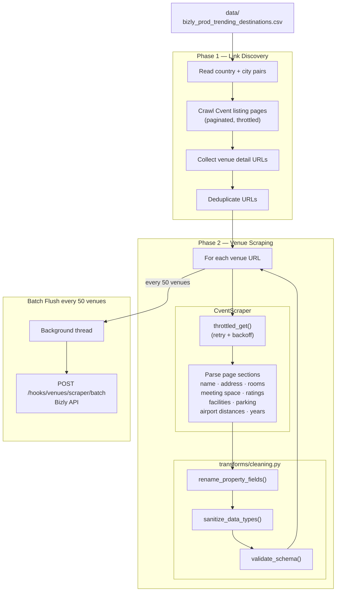

# Cvent Venue Scraper

A modular Python scraper that collects venue details from Cvent.com for a given list of city/country destinations.

## How It Works

**Phase 1 — Link Discovery**
Reads a CSV of country/city pairs and crawls Cvent's venue listing pages to collect all venue detail page URLs.

**Phase 2 — Venue Scraping**
For each discovered URL, scrapes the full venue detail page and extracts name, address, room counts, meeting space, ratings, parking, airport distances, facilities, year built/renovated, tax rate, and occupancy rate. Results are batched and sent to the Bizly API every 50 venues.



---

## Prerequisites

- Python 3.12.x (required — tested on 3.12; earlier versions are not supported)
- pip

---

## Setup

### 1. Clone or download the project

```bash
cd "cvent scraper"
```

### 2. Create and activate a virtual environment

```bash
python3 -m venv venv
source venv/bin/activate
```

> On Windows: `venv\Scripts\activate`

### 3. Install dependencies

```bash
pip install -r requirements.txt
```

### 4. Configure environment variables

```bash
cp .env.example .env
```

Open `.env` and adjust values as needed. The defaults are sensible for a first run:

| Variable | Default | Description |
|---|---|---|
| `DEBUG_MODE` | `true` | If `true`, only processes the first `DEBUG_LIMIT` venues |
| `DEBUG_LIMIT` | `5` | Number of venues to scrape in debug mode |
| `MAX_PAGES` | `5` | Max pagination pages to crawl per city |
| `MIN_DELAY` | `1.0` | Min seconds to wait between requests |
| `MAX_DELAY` | `3.0` | Max seconds to wait between requests |
| `REQUEST_TIMEOUT` | `20` | HTTP request timeout in seconds |
| `MAX_RETRIES` | `3` | Number of retry attempts on failed requests |
| `INPUT_CSV` | `data/bizly_prod_trending_destinations.csv` | Path to the input destinations file |
| `OUTPUT_DIR` | `output` | Directory where the results CSV is written |
| `OUTPUT_FILENAME` | `cvent_venues.csv` | Name of the output CSV file |

### 5. Add the input CSV

Place your destinations file at:

```
data/bizly_prod_trending_destinations.csv
```

The file must contain at least these two columns:

```
country,city_name
United States,New York
France,Paris
```

---

## Running

```bash
python main.py
```

Output is written to `output/cvent_venues.csv`.

### Debug mode (default)

With `DEBUG_MODE=true` in `.env`, only the first 5 venues are scraped. This is useful for verifying the setup before a full run.

### Full production run

Set `DEBUG_MODE=false` in `.env`, then run:

```bash
python main.py
```

---

## Project Structure

```
cvent-scraper/
├── main.py                              # Entry point — orchestrates Phase 1 then Phase 2
├── config.py                            # All tunable settings
├── services/
│   ├── http.py                          # throttled_get(), HEADERS, session setup
│   └── scraper.py                       # CventScraper class — Phase 1 + Phase 2
├── models/
│   └── venue.py                         # VenueDetailsSchema (Pydantic model)
├── transforms/
│   └── cleaning.py                      # Data cleaning and type conversion
├── storage/
│   ├── csv_writer.py                    # CSV utility (kept for local use)
│   └── bizly_api/
│       └── insert_batch_venues.py       # Batch POST to Bizly API
├── data/                                # Place input CSV here
├── output/                              # Local CSV output (gitignored)
├── .env.example                         # Environment variable template
└── requirements.txt
```

---

## Deactivating the virtual environment

```bash
deactivate
```
